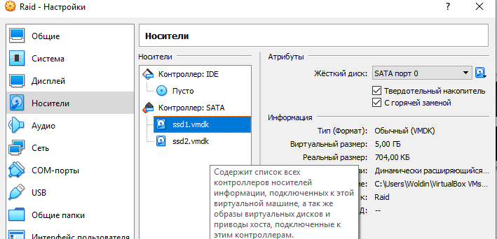
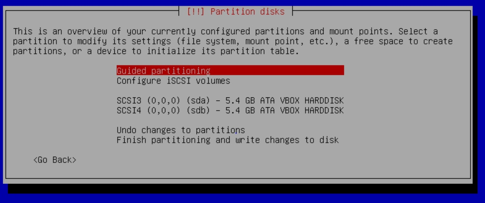
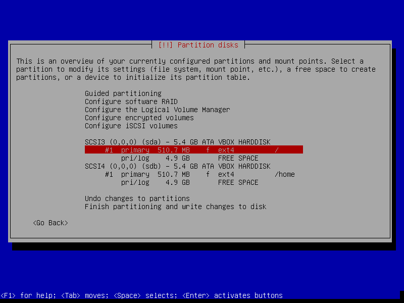
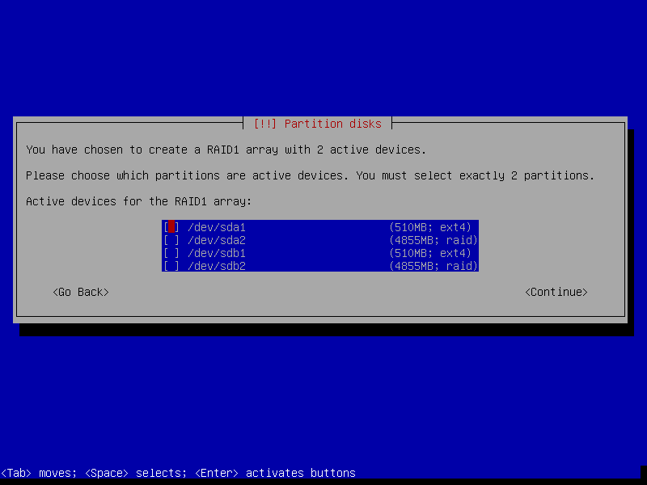
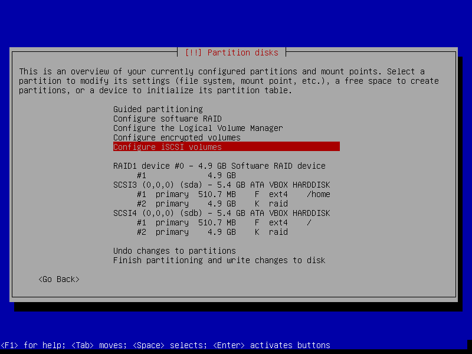

## Лабораторная работа 2

### Задание 1 (Установка ОС и настройка LVM, RAID)
1.Создание новой виртуальной машины, выдав ей следующие характеристики:
* 1 gb ram
* 1 cpu
* 2 hdd (назвав их ssd1, ssd2 и назначил равный размер, поставив галочки hot swap и ssd)
* SATA контроллер настроен на 4 порта

2.Начало установки Linux:

*Настройка отдельного раздела под /boot: Выбрав первый диск, создал на нем новую таблицу разделов
*Partition size: 512M
*Mount point: /boot
*Повторил настройки для второго диска, выбрав mount point:none

*Настройка RAID
*Выбрал свободное место на первом диске и настроил в качестве типа раздела physical volume for RAID
*Выбрал "Done setting up the partition"
*Повторил настройку для второго диска

*Выбрал пункт "Configure software RAID"
*Create MD device
*Software RAID device type: Выберал зеркальный массив
*Active devices for the RAID XXXX array: Выбрал оба диска
*Spare devices: Оставил 0 по умолчанию
*Active devices for the RAID XX array: Выбрал разделы, которые создавал под raid
*Finish
*В итоге получил: 
