## Лабораторная работа 2

### Задание 1 (Установка ОС и настройка LVM, RAID)
1.Создание новой виртуальной машины, выдав ей следующие характеристики:
* 1 gb ram
* 1 cpu
* 2 hdd (назвав их ssd1, ssd2 и назначил равный размер, поставив галочки hot swap и ssd)
* SATA контроллер настроен на 4 порта

2.Начало установки Linux:

* Настройка отдельного раздела под /boot: Выбрав первый диск, создал на нем новую таблицу разделов
* Partition size: 512M
* Mount point: /boot
* Повторил настройки для второго диска, выбрав mount point:none

* Настройка RAID
* Выбрал свободное место на первом диске и настроил в качестве типа раздела physical volume for RAID
* Выбрал "Done setting up the partition"
* Повторил настройку для второго диска

* Выбрал пункт "Configure software RAID"
* Create MD device
* Software RAID device type: Выберал зеркальный массив
* Active devices for the RAID XXXX array: Выбрал оба диска
* Spare devices: Оставил 0 по умолчанию
* Active devices for the RAID XX array: Выбрал разделы, которые создавал под raid
* Finish
* В итоге получил: 

* Настройка LVM: Выбрал Configure the Logical Volume Manager
* Keep current partition layout and configure LVM: Yes
* Create volume group
* Volume group name: system
* Devices for the new volume group: Выбрал созданный RAID
* Create logical volume
* logical volume name: root
* logical volume size: 2\5 от размера диска
* Create logical volume
* logical volume name: var
* logical volume size: 2\5 от размера диска
* Create logical volume
* logical volume name: log
* logical volume size: 1\5 от размера диска
* Завершив настройку LVM увидел следующее: 
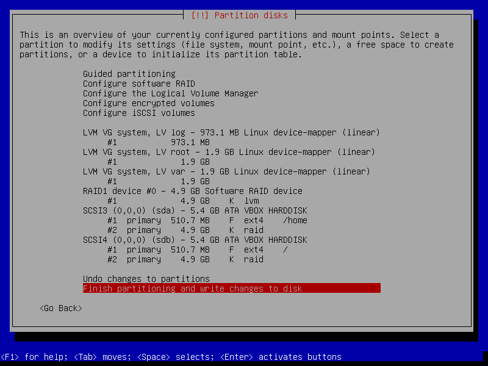
* Разметка разделов: по-очереди выбрал каждый созданный в LVM том и разметил их, например, для root так:
* Use as: ext4
* mount point: /
* повторил операцию разметки для var и log выбрав соответствующие точки монтирования (/var и /var/log), получив следующий результат:

3.Закончил установку ОС, поставив grub на первое устройство (sda) и загрузил систему.
4.Выполнил копирование содержимого раздела /boot с диска sda (ssd1) на диск sdb (ssd2)
5.Выполнил установку grub на второе устройство: 
* Посмотрел информацию о текущем raid командой cat /proc/mdstat (не было своего скриншота): 
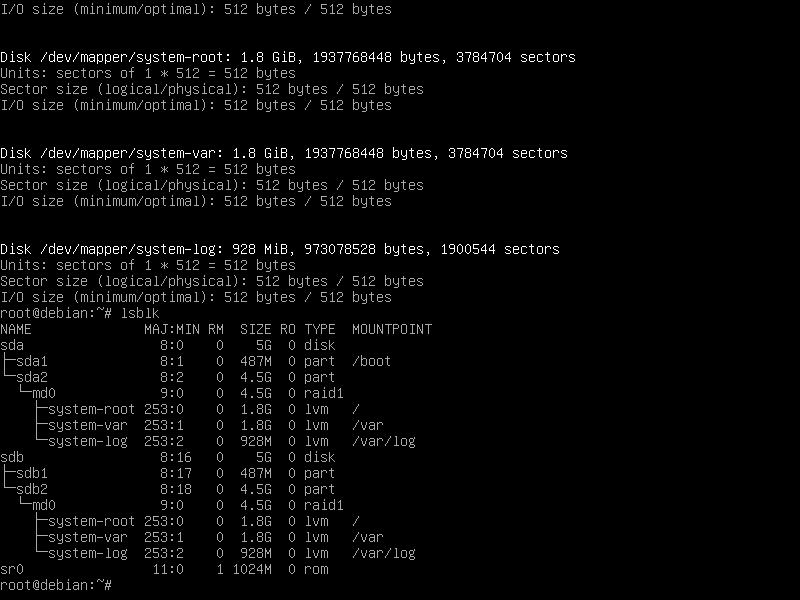
Увидел, что активны два raid1 sda2[0] и sdb2[1]
* Выводы команд: pvs, vgs, lvs, mount: 
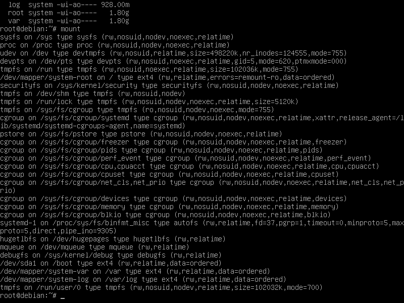
* С помощью этих команд увидел информацию об physical volumes, volume groups, logical volumes, примонтированных устройств.
#### Вывод
В этом задании научился устанавливать ОС Linux, настраивать LVM и RAID, а также ознакомился с командами:
* lsblk -o NAME,SIZE,FSTYPE,TYPE,MOUNTPOINT
* fdisk -l
* pvs,lvs,vgs
* cat /proc/mdstat
* mount
* dd if=/dev/xxx of=/dev/yyy
* grub-install /dev/XXX
* В результате получил виртуальную машину с дисками ssd1, ssd2.
### Задание 2 (Эмуляция отказа одного из дисков)
1.Удаление диска ssd1 в свойствах машины.

2.Проверка работоспособности виртуальной машины.

3.Проведена перезагрузка.

4.Проверка статуса RAID-массива командой cat /proc/mdstat. 
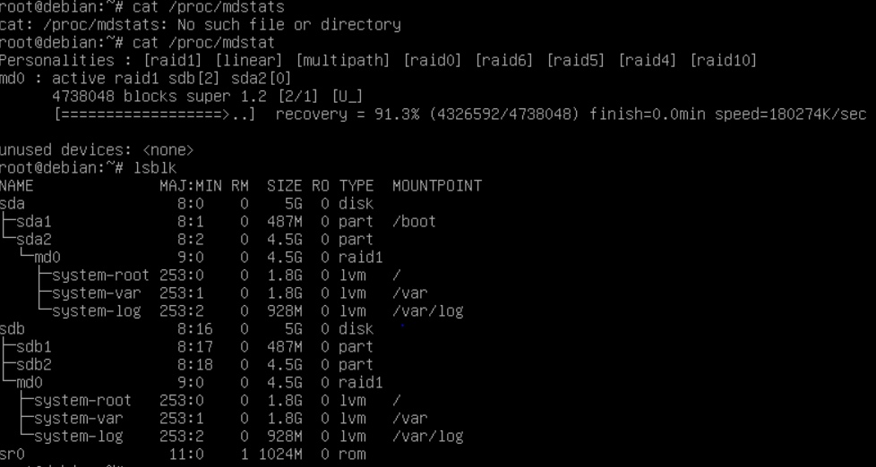
5.Добавление в интерфейсе VM нового диска такого же размера с названием ssd3.

6.Выполнение операций:
* Просмотр нового диска, что он приехал в систему командой fdisk -l
* Копирование таблиц разделов со старого диска на новый: sfdisk -d /dev/XXXX | sfdisk /dev/YYY
* Добавление в рейд массив нового диска: mdadm --manage /dev/md0 --add /dev/YYY
* Результат:

7.Выполение синхронизации разделов, не входящих в RAID

8.Установка grub на новый диск 
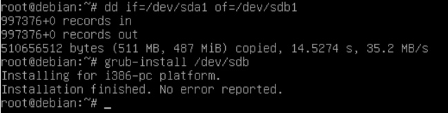

9.Перезагрузка ВМ и проверка, что все работает 

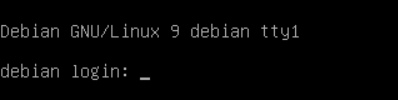
#### Вывод
В этом задании научился:

* Удалять диск ssd1
* Проверять статус RAID-массива
* Копировать таблицу разделов со старого диска на новый
* Добавлять в рейд массив новый диск
* Выполнять синхронизацию разделов, не входящих в RAID
Изучил новые команды:

* sfdisk -d /dev/XXXX | sfdisk /dev/YYY
* mdadm --manage /dev/md0 --add /dev/YYY
Результат: Удален диск ssd1, добавлен диск ssd3, ssd2 сохранили

### Задание 3 (Добавление новых дисков и перенос раздела)
1.Эмулирую отказа диска ssd2, удалив из свойств ВМ диск и перезагрузившись

2.Текущее состояние дисков и RAID: 
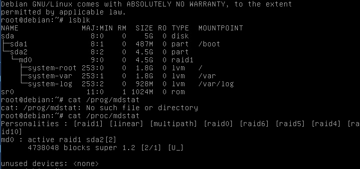

4.Добавляю ssd4 

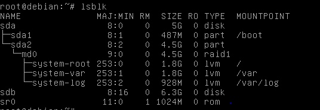

5.Перенос данных с помощью LVM.
* Копирование файловую таблицу со старого диска на новый
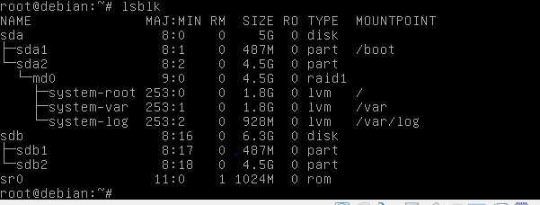
* Копирование данных /boot на новый диск
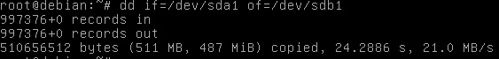
* Перемонтировака /boot на живой диск

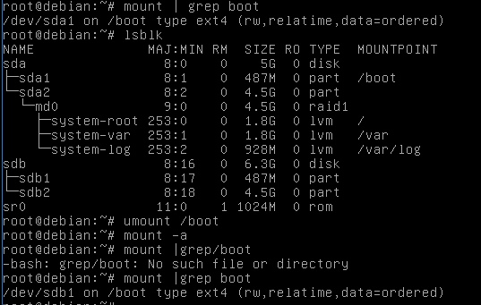

* Установка grub на новый диск Grub устанавливаем, чтобы могли загрузить ОС с этого диска

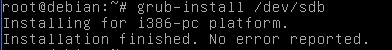

* Создание нового RAID-массива с включением туда только одного нового ssd диска:

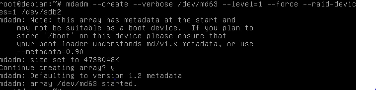

* Результат 

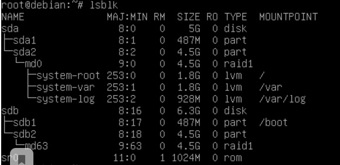

Появился /dev/md63

6.Настройка LVM
* Выполнение команды pvs для просмотра информации о текущих физических томах
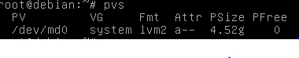
* Создание нового физического тома, включив в него ранее созданный RAID массив:
* После выполнения команд lsblk -o NAME,SIZE,FSTYPE,TYPE,MOUNTPOINT и pvs яувидел, что к md63 добавился FSTYPE - LVM2_member, так же dev/md63 добавился к результату команды pvs.
* Увеличение размера Volume Group system
* Выполнение команд
vgdisplay system -v
pvs
vgs
lvs -a -o+devices
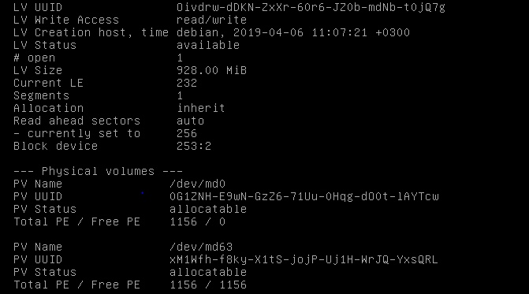
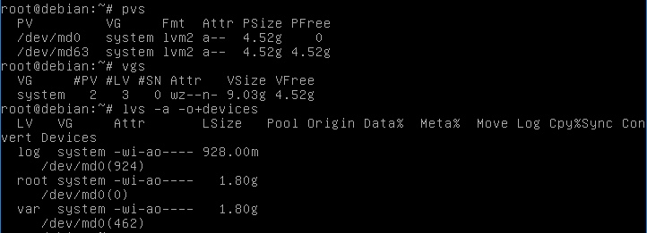

var,log,root находятся на /dev/md0
* Перемещение данных со старого диска на новый
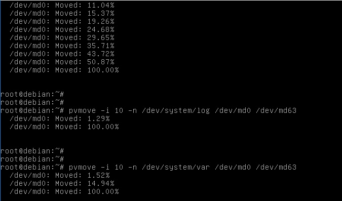
* Изменение VG, удалив из него диск старого raid.
* Выполнение команд:

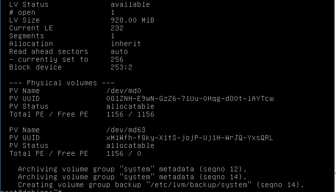
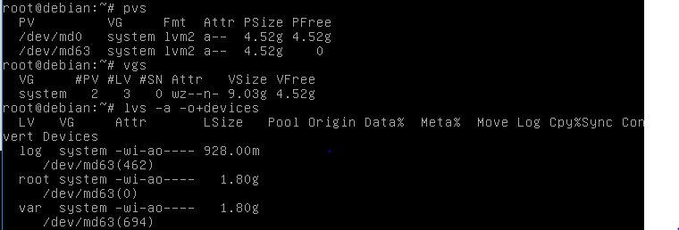
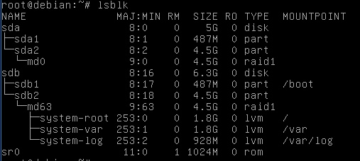

В выводе команды pvs у /dev/md0 исчезли VG и Attr. В выводе команды vgs #PV - уменьшилось на 1, VSize, VFree - стали меньше
7.Удаление ssd3 и добавление ssd5,hdd1,hdd2.

8.Полсе добавления дисков:
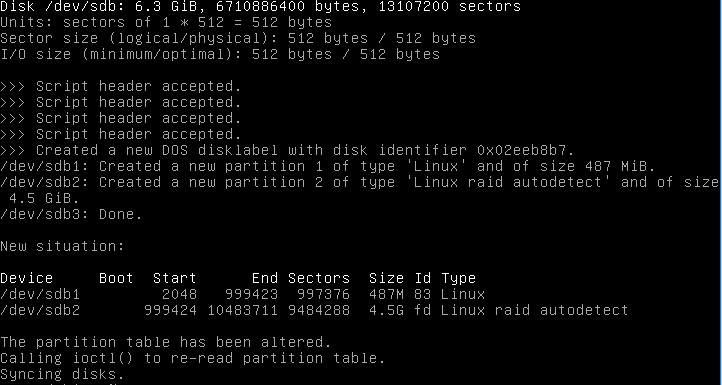

9.Восстановление работы RAID массива:

* Копирование таблицы разделов:
10.Копирование загрузочного раздела /boot с диска ssd4 на ssd5
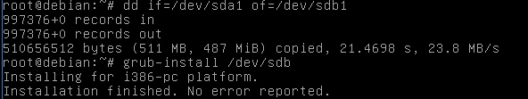

11.Установка grub на ssd5 

12.Изменение размера второго раздела диска ssd5 
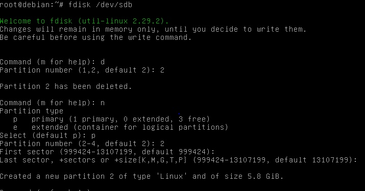
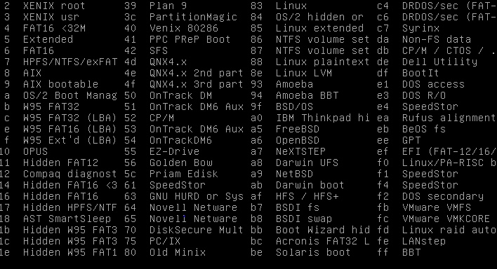
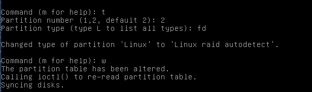

13.Перечитывание таблицы разделов
* Добавление нового диска к текущему raid массиву
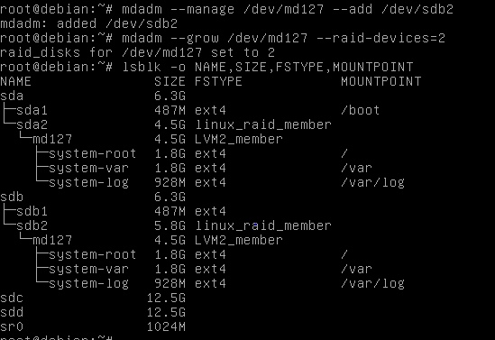
* Расширение количество дисков в массиве до 2-х штук:
14.Увеличение размера раздела на диске ssd4 
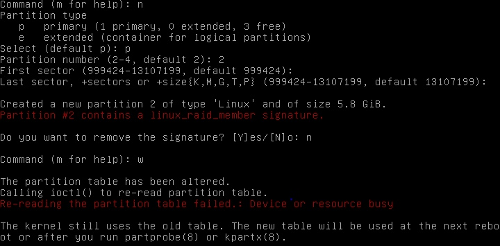
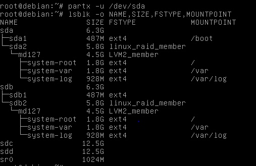

15.Перечитаем таблицу разделов

16.Расширение размера raid 

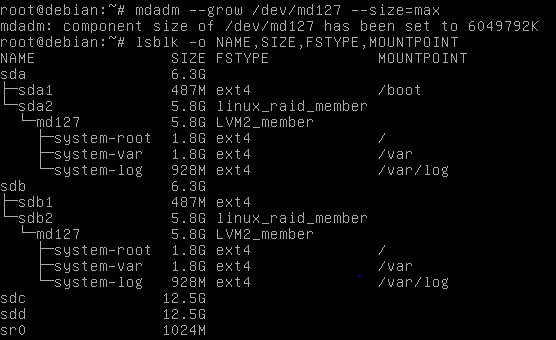

Размер md127 изменился, теперь он равен 5,8G.

17.Расширим размер PV. 
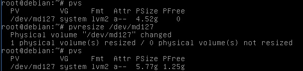

18.Добавление вновь появившееся место VG var,root. 
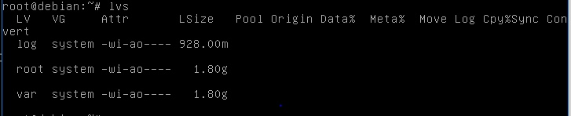
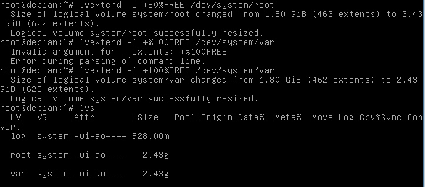
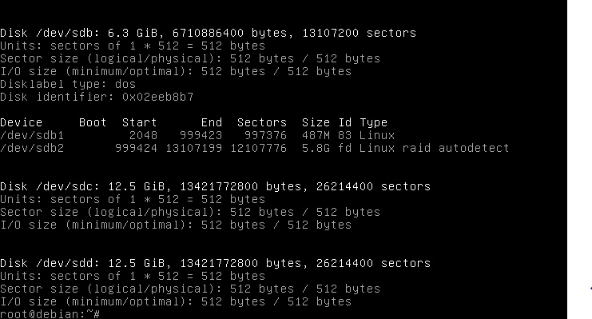

19.Создание LVM на новых hdd.
Имена новых hhd дисков: 

* Создание RAID массива 
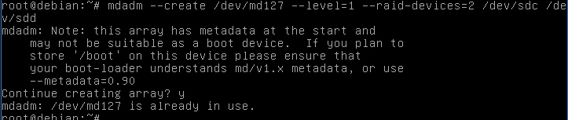
* Создание нового PV на рейде из больших дисков
* Создание в этом PV группу с названием data
* Создание логического тома с размером всего свободного пространства и присвоением ему имени var_log
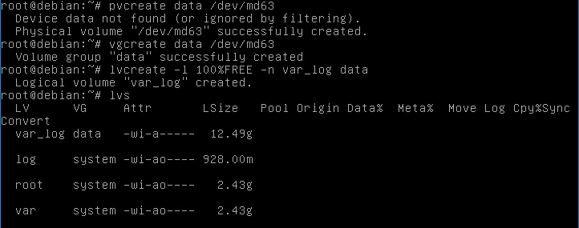
* Отформатирование созданного раздела в ext4
* Результат: 

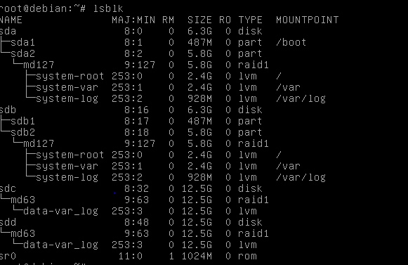

20.Перенос данных логов со старого раздела на новый
* Примонтирование временно нового хранилище логов
* Выполнение синхронизации разделов 
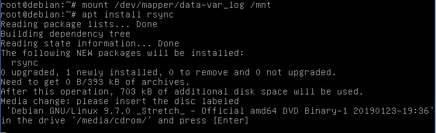
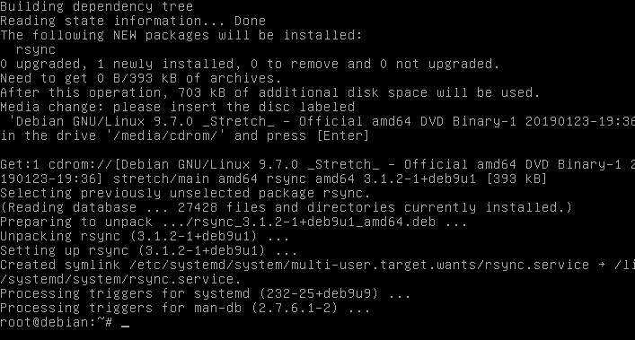
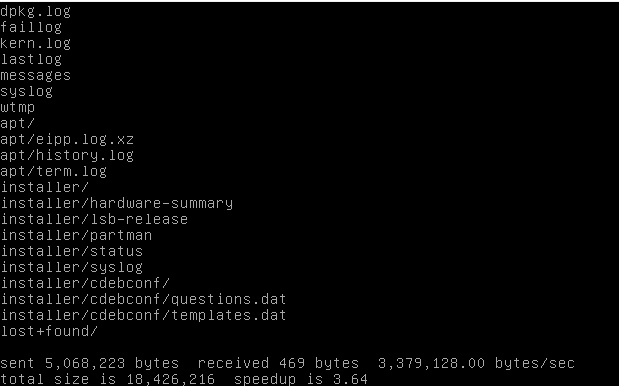
* Процессы работающие с /var/log 
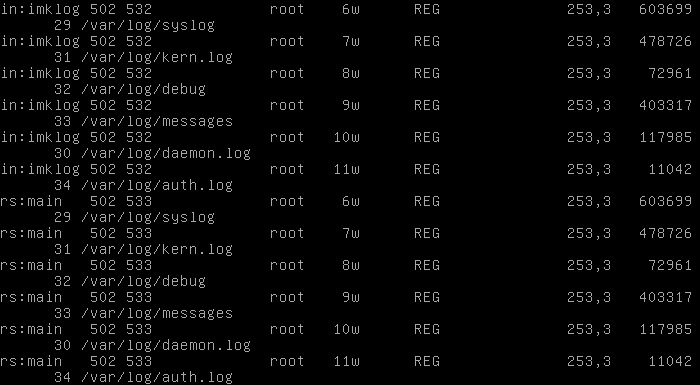
* Остановка этих процессов

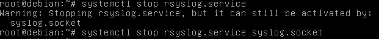
* Выполнение финальной синхронизации разделов
* Поменяем местами разделы
* Результат: 

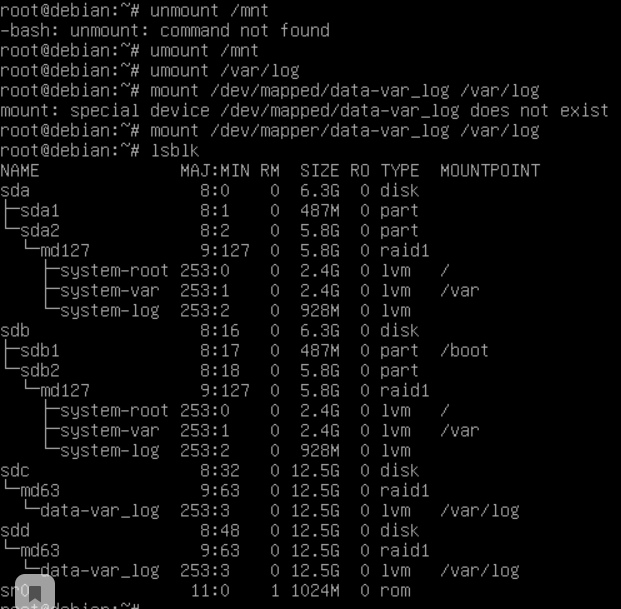

21.Правим /etc/fstab. 
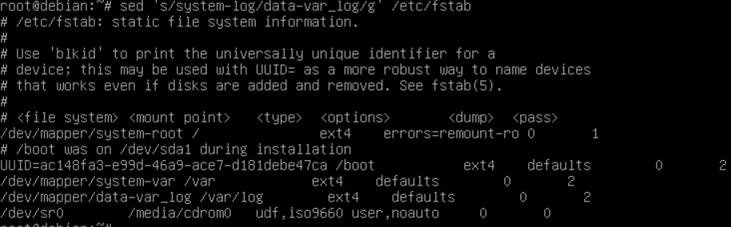
22.Финальный аккорд(проверка всего)
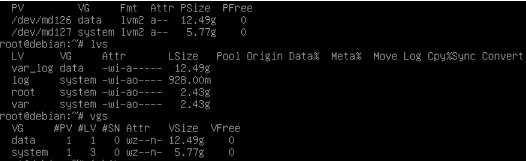
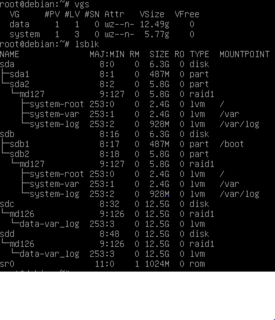
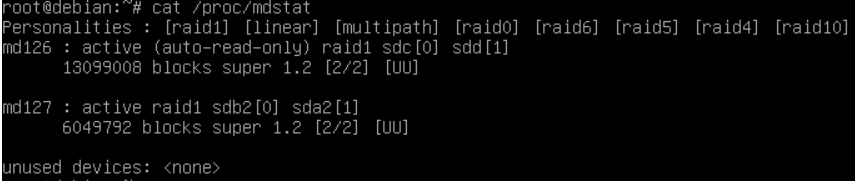